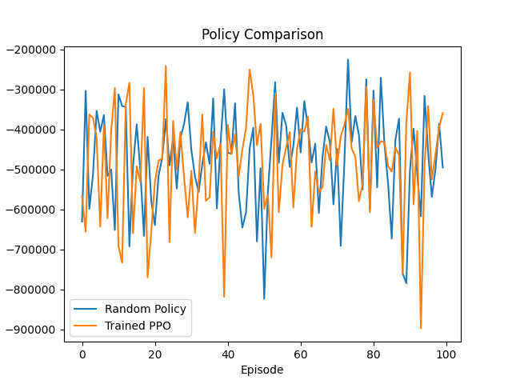
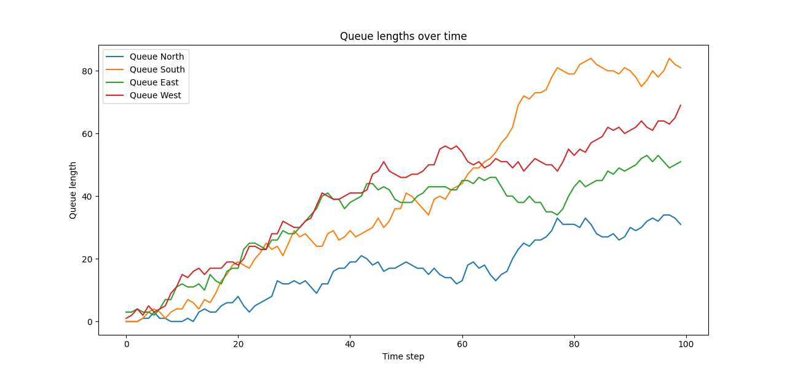
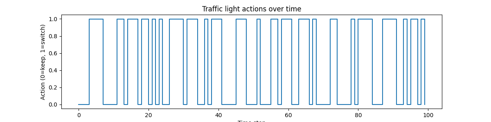

# 🚦 Traffic Light Optimization using PPO

This project uses **Reinforcement Learning (PPO)** from **Stable-Baselines3** to optimize traffic light control at a simulated four-way intersection.  
The goal: **Minimize queue lengths** by deciding when to switch lights.

---

## 📖 Project Overview
We define a custom **Gym environment** `TrafficEnv` where:
- Cars arrive from **North, South, East, West** (Poisson distribution)
- Lights have two phases: `NS Green` or `EW Green`
- The agent decides to **keep** or **switch** the light
- Reward = negative squared sum of queue lengths (penalizing long waits)

The PPO agent learns an optimal switching strategy by interacting with the environment.

---

## ⚙️ Features
✅ Custom OpenAI Gym environment  
✅ PPO training using Stable-Baselines3  
✅ Evaluation of **Random vs Trained policy**  
✅ Visualization of:
- Total reward per episode
- Queue length changes over time
- Actions taken (switch/keep)

---

## 📂 Project Structure
traffic-light-ppo/
- ├── traffic_env.py       # Custom traffic environment
- ├── train.py             # Train PPO agent
- ├── simulate.py          # Run trained model and visualize results
- ├── requirements.txt     # Python dependencies
- └── README.md            # Project documentation

## 🛠 Installation & Setup
### Clone this repository
git clone https://github.com/Utdktud7k57/traffic-light-ppo.git
cd traffic-light-ppo
### Install dependencies
pip install -r requirements.txt
### Train the PPO Agent
python train.py
### Run Simulation & Visualization
python simulate.py

## 📊 Results
- Policy Comparison
 Trained PPO policy achieves significantly higher rewards than a random policy.
 - Queue Lengths Over Time
 The PPO agent keeps queue lengths lower over the simulation.

### Policy Comparison

### Queue Lengths Over Time

### Traffic Light Actions Over Time

## 🎯 Key Features
- Custom-built traffic simulation environment using OpenAI Gym.
- Agent trained with Proximal Policy Optimization (PPO).
- Clear performance comparison with a random policy baseline.
- Visual analytics for queues and actions.

## 🏆 Conclusion
This project demonstrates how reinforcement learning can optimize traffic light control, reducing congestion and improving flow efficiency. The PPO agent learned strategies that outperformed a random baseline, showcasing the potential of AI-driven traffic systems.

## Future Improvements
- Add multiple intersections for more realistic simulation.
- Include varying traffic patterns (rush hour, low traffic, etc.).
- Deploy as a live simulation in a web app.

##  Author 
- Tejaswini Samudrala
- GitHub: https://github.com/Utdktud7k57
